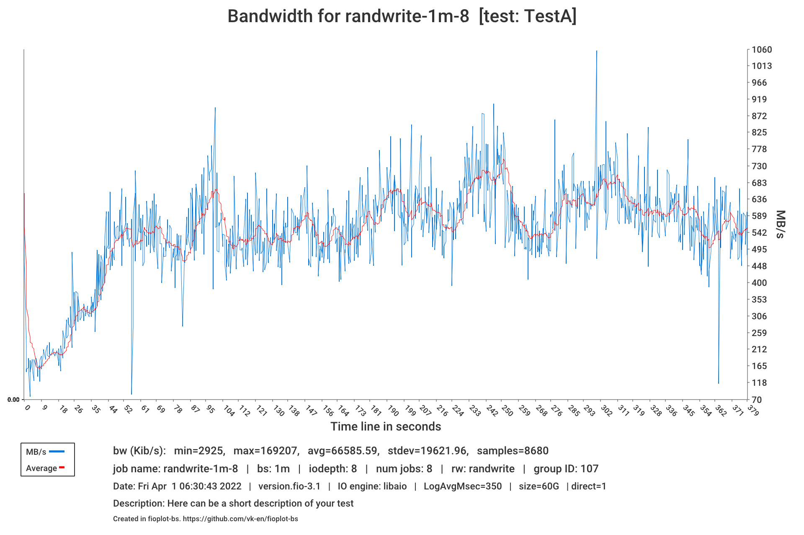
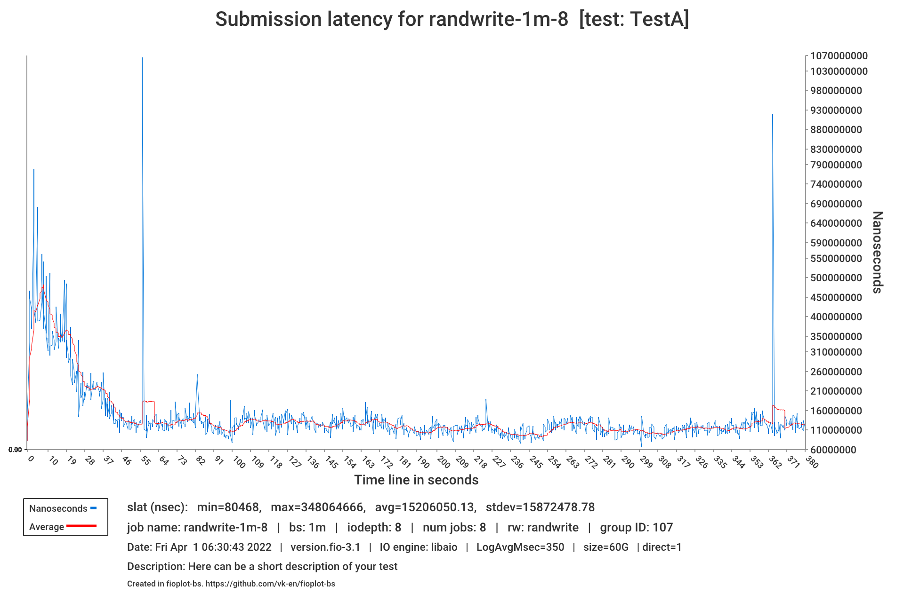

# fioplot-bs

<p align="center"></p>

<p align="center">
    <a href="https://github.com/vk-en/fioplot-bs/actions/workflows/build.yml"></a>
    <a href="https://goreportcard.com/report/github.com/vk-en/fioplot-bs"></a>
    <a href="https://opensource.org/licenses/BSD-3-Clause"></a>
    <a href="https://pkg.go.dev/github.com/vk-en/fioplot-bs"></a>
</p>

## Introduction

fioplot-bs is a utility that allows you to create graphs and xlsx tables based
on the results of the performance testing utility - [FIO](https://fio.readthedocs.io/en/latest/fio_doc.html).

## Features and functionality

1. Compares the results of different tests with the same patterns, creating a general report.

   > This is very convenient if you compare the performance of different software solutions using the same hardware and the same testing patterns (fio config). How it works will be written in the _"How it works"_ section.

2. Generates CSV tables for each test for visual convenience.

   > Basic functionality. Generates a CSV table for each \*.json file with FIO results.

3. Able to work with log files.

   > In the current version of the program, it is not yet possible to generate graphs for results from different tests with common patterns. But it is possible to turn the log files for bandwich and latency obtained from FIO into visual diagrams for a specific test. This is useful for finding/analyzing/detecting latency and performance spikes. Also, there is no support yet for pattern charts with joint randrw/rw loads. Since the resolution of the images has been increased, the time of plotting has also increased.

4. Draws graphs and charts in various formats.

   > At the moment, graphs and charts can be created in the following formats: `.png` and `.svg`

5. Able to generate reports with a graphical representation in the form of xlsx tables.
   > This is done for the convenience of uploading results to cloud storages, such as google drive. Such a report has a separate page for each type (Performance, IOPS, Latency, and so on), as well as a separate page with graphs from data from all pages.

## How it works

### Preparation and dependencies

To build and run the utility, you need the golang package on your system (you can download it on [the official website here](https://go.dev/dl/)).

### Installation

```bash
git clone https://github.com/vk-en/fioplot-bs.git

cd fioplot-bs

go build -v

./fioplot-bs -h
```

### Example usage

Before you need this utility, you need to perform the required testing using the FIO utility.
For this test, you need to run the FIO command with the options: `--output-format=normal,json --output=TestA.json` or just `--output-format=json --output=TestB.json`. For example:

```bash
fio /fio_config.cfg --output-format=normal,json --output=TestA.json
```

> Where `/fio_config.cfg` this is configuration for tests. How to create test configurations for FIO can be [found here](https://fio.readthedocs.io/en/latest/fio_doc.html#job-file-format).

Further, when the results are already available, you can put them in one directory and specify this directory in fioplot-bs as the directory where the results are stored in the form of JSON (For example: --catalog=/home/fioResults/).

Expected file tree for the directory with FIO results from which graphs/charts and reports will be built:

```bash
ls -l /home/fioResults/
> -rw-r--r--  1 user  staff  899793 Apr  7 07:18 TestA.json
> -rw-r--r--  1 user  staff  899234 Apr  7 09:10 TestB.json
> -rw-r--r--  1 user  staff  812257 Apr  7 11:20 TestC.json
> drwxr-xr-x 87 user  staff    2784 Apr 29 17:49 LogsTestA
> drwxr-xr-x 87 user  staff    2784 Apr 29 17:49 LogsTestB
> drwxr-xr-x 87 user  staff    2784 Apr 29 17:49 LogsTestC
```

Where the logs directories looks something like this:

```bash
ls -l /home/fioResults/LogsTestA

> -rw-r--r--  1 user  staff  14658 Dec 13  2021 write-64k-0_bw.376.log
> -rw-r--r--  1 user  staff  15219 Dec 13  2021 write-64k-0_clat.376.log
> -rw-r--r--  1 user  staff  13221 Dec 13  2021 write-64k-0_iops.376.log
> -rw-r--r--  1 user  staff  15220 Dec 13  2021 write-64k-0_lat.376.log
> -rw-r--r--  1 user  staff  13959 Dec 13  2021 write-64k-0_slat.376.log
...

```

**fioplot-bs usage example:**

```bash
./fioplot-bs --name=MyFirstTest --catalog=/home/fioResults --loggraphs
```

Where:

- `--name` - Specifies the common name of the test (Ex. `Comparison-of-market-storage-leaders`). Specified **without** spaces. And serves as the name of the directory where the results will be generated

- `--catalog` - The directory where you put the results from different tests as JSON files and folders with logs(if have). (The extension must also be `*.json`)

- `--loggraphs` - The flag for creating graphs from log files. If you don't have logging files, don't specify it.

Upon successful completion, a directory with results will appear with the following hierarchy:

```text
MyFirstTest/
├── bar-charts
│   └── ...
├── csv-tables
│   └── ...
├── log-graphs
│   └── ...
└── MyFirstTest.xlsx
```

**Random sample from graph and charts for example:**

<a href="img/bw-example.png"><p align="left"></p></a>

<a href="img/slat-example.png"><p align="left"></p></a>

<a href="https://svgshare.com/i/ihA.svg"><p align="left"></p></a>

You can also see the entire list of available options and commands by running the command:

```bash
./fioplot-bs --help
```

## For Developers

### Get packages

```bash
go get github.com/vk-en/fioplot-bs/pkg/barchart
go get github.com/vk-en/fioplot-bs/pkg/xlsxchart
go get github.com/vk-en/fioplot-bs/pkg/csvtable
```

### Example with code

Here is a minimal example usage that will create charts or report.

```go
package main

import (
    "fmt"
    "strings"

    "github.com/vk-en/fioplot-bs/pkg/barchart"
    "github.com/vk-en/fioplot-bs/pkg/csvtable"
)

func main() {
    var csvFiles []string
    var jsonFiles []string{"TestA.json", "TestB.json", "TestC.json"}

    for _, json := range jsonFiles {
        csvFileName := strings.Replace(json, ".json", ".csv", -1)
        if err := csvtable.ConvertJSONtoCSV(json, csvFileName); err != nil {
            fmt.Println(err)
        return
        }
        csvFiles = append(csvFiles, csvFileName)
    }

    if err := barchart.CreateBarCharts(csvFiles, "MyFirstBarCharts", "/home/MyReport/", "svg"); err != nil {
        fmt.Printf("could not create barCharts.\n Error: %v\n", err)
    } else {
        fmt.Println("Results and graphs were generated successfully!")
    }
}
```

## Problems

- Inaccurate merging of log files, sometimes there is a slight difference between streams in time. It is necessary to implement rounding to the second. For this reason, the data on the graph may not always match the description below it.

## Contributing

Contributions are welcome! Open a pull request to fix a bug, or open an issue to discuss a new feature or change.

## Licenses

This program is under the terms of the BSD 3-Clause License. See [https://opensource.org/licenses/BSD-3-Clause](https://opensource.org/licenses/BSD-3-Clause).

gopher.{ai,svg,png} was created by [Takuya Ueda](https://twitter.com/tenntenn). Licensed under the [Creative Commons 3.0 Attributions license](http://creativecommons.org/licenses/by/3.0/).

This utilities uses packages [Gonum Plot](https://github.com/gonum/plot) to generate barcharts and graphs. "Gonum Plot" licensed under the [BSD 3-Clause License](https://opensource.org/licenses/BSD-3-Clause).

This utilities uses package [Excelize](https://github.com/qax-os/excelize) to generate xlsx file. "Excelize" licensed under the [BSD 3-Clause License](https://opensource.org/licenses/BSD-3-Clause).
